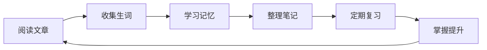

# 🎯 英语学习中心

> 欢迎来到你的个人英语学习仓库！

---

## 📌 快速导航

### 📖 阅读材料
- [[01_ReadingMaterials|阅读材料库]]
  - [[01_ReadingMaterials/Academic|学术文章]]
  - [[01_ReadingMaterials/Daily|日常英语]]
  - [[01_ReadingMaterials/News|新闻资讯]]
  - [[01_ReadingMaterials/Literature|文学作品]]
- [[01_ReadingMaterials/ByLevel|按难度分级]]
  - [[01_ReadingMaterials/ByLevel/Beginner|初级]]
  - [[01_ReadingMaterials/ByLevel/Intermediate|中级]]
  - [[01_ReadingMaterials/ByLevel/Advanced|高级]]

### 📝 单词学习
- [[02_Vocabulary|单词库]]
  - [[02_Vocabulary/ByTopic|按主题分类]]
  - [[02_Vocabulary/ByLevel|按难度分级]]
  - [[02_Vocabulary/ByMastery|按掌握程度]]
- [[02_Vocabulary/ByAlphabet|字母索引]]

### 📔 学习笔记
- [[03_Notes/ByDate|按日期查看]]
- [[03_Notes/ByTopic|按主题查看]]
  - [[03_Notes/ByTopic/Grammar|语法]]
  - [[03_Notes/ByTopic/Writing|写作]]
  - [[03_Notes/ByTopic/Reading|阅读]]
  - [[03_Notes/ByTopic/Listening|听力]]
  - [[03_Notes/ByTopic/Speaking|口语]]

### 🔄 复习系统
- [[04_Review/DailyReview|每日复习]]
- [[04_Review/WeeklyReview|每周复习]]
- [[04_Review/MonthlyReview|每月复习]]
- [[04_Review/SpecialFocus|专项突破]]

### 📚 资源库
- [[05_Resources/Grammar|语法资料]]
- [[05_Resources/WritingTemplates|写作模板]]
- [[05_Resources/Listening|听力材料]]
- [[05_Resources/Tools|学习工具]]

---

## 🎯 今日学习

### 📅 日期
**今天**: <% tp.date.now("YYYY-MM-DD dddd") %>

### ✅ 今日任务
- [ ] 阅读一篇英文文章
- [ ] 学习 10 个新单词
- [ ] 完成单词复习
- [ ] 整理学习笔记
- [ ] 填写每日回顾

---

## 📊 学习统计

### 本周进度
- 学习天数：/7 天
- 新增单词：个
- 阅读文章：篇
- 学习时长：分钟

### 本月进度
- 学习天数：/30 天
- 新增单词：个
- 阅读文章：篇

> 💡 提示：使用 Dataview 插件可以自动显示统计数据

---

## 🔥 快速操作

### 创建新内容
- [[06_Templates/Reading Template|新建阅读笔记]]
- [[06_Templates/Vocabulary Template|新建单词卡片]]
- [[06_Templates/Note Template|新建学习笔记]]
- [[06_Templates/Daily Review Template|新建每日回顾]]

### 常用功能
- 划词翻译：选中单词即可查看释义
- 添加单词：使用快捷键快速收录生词
- 创建复习卡片：一键生成 Anki 卡片
- 查看统计：访问 [[08_Statistics|学习统计]] 页面

---

## 📈 最近学习

### 最近阅读
```dataview
TABLE date, level, topic 
FROM "01_ReadingMaterials" 
WHERE type = "reading"
SORT date DESC 
LIMIT 5
```

### 新增单词
```dataview
TABLE phonetic, pos, mastery 
FROM "02_Vocabulary" 
WHERE type = "vocabulary"
SORT createdDate DESC 
LIMIT 5
```

### 最新笔记
```dataview
TABLE date, topic 
FROM "03_Notes" 
WHERE type = "note"
SORT date DESC 
LIMIT 5
```

---

## 🎓 学习流程



---

## 💡 学习建议

### 📖 阅读训练
1. 选择适合你水平的文章（i+1 原则）
2. 第一遍通读，理解大意
3. 第二遍标记生词和难点
4. 第三遍深入学习语言表达
5. 读后总结，写摘要和感想

### 📝 单词记忆
1. 每日新学 10-20 个单词
2. 使用间隔重复法复习
3. 结合例句和语境记忆
4. 建立单词间的联系
5. 定期测试掌握程度

### 🔄 复习策略
1. 每日复习前一天内容
2. 每周进行系统复习
3. 每月总结学习成果
4. 根据掌握程度调整复习频率

---

## 🔗 相关链接

- [[仓库使用指南]]
- [[学习操作手册]]
- [[插件配置说明]]
- [[常见问题解答]]

---

*最后更新：{{date}}*
*保持学习，每天进步一点点！💪*
