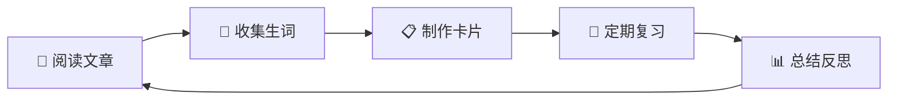

# 🎓 sxz_LearnEnglish 英语学习仓库

> 一个功能完善、结构清晰的 Obsidian 英语学习系统

---

## 📋 快速导航

### 📖 文档中心
- [[02-仓库使用指南|📘 仓库使用指南]] - 完整功能说明
- [[03-操作手册|📗 操作手册]] - 详细操作步骤
- [[04-插件配置指南|📙 插件配置指南]] - 插件配置详解
- [[01-文件命名规范|📕 文件命名规范]] - 命名规则说明

### 📁 核心区域
- [[00-Inbox]] - 📥 临时收集箱
- [[01-Reading]] - 📖 阅读材料区
- [[02-Vocabulary]] - 📝 词汇库
- [[03-Notes]] - 📓 学习笔记
- [[07-Review-System]] - 🔄 复习系统

### 📋 模板库
- [[Vocabulary-Card-Template]] - 单词卡片模板
- [[Reading-Article-Template]] - 阅读文章模板
- [[Daily-Note-Template]] - 每日笔记模板
- [[Weekly-Review-Template]] - 周复习模板

---

## 🎯 仓库特色

### ✨ 核心功能

#### 1. 📖 阅读辅助系统
- ✅ 多难度分级阅读材料
- ✅ 划词翻译和单词查询
- ✅ 自动提取生词
- ✅ 难句解析和笔记
- ✅ 阅读进度追踪

#### 2. 📝 词汇管理系统
- ✅ 多维度分类 (字母/主题/难度)
- ✅ 完整单词信息 (音标/词性/释义/例句)
- ✅ 记忆方法记录
- ✅ 相关词汇关联
- ✅ 间隔重复复习

#### 3. 🔄 智能复习系统
- ✅ SM-2 记忆算法
- ✅ 自动安排复习计划
- ✅ 记忆曲线追踪
- ✅ 学习统计分析
- ✅ 卡片牌组管理

#### 4. 📊 学习追踪系统
- ✅ 每日学习记录
- ✅ 周/月总结模板
- ✅ 数据可视化展示
- ✅ 进度追踪仪表板
- ✅ 学习成果统计

---

## 🚀 快速开始

### 新手入门步骤

#### 1️⃣ 配置插件
```
1. 打开 Obsidian 设置
2. 启用所有已安装插件
3. 按照 [[04-插件配置指南]] 配置各插件
4. 测试核心功能是否正常
```

#### 2️⃣ 设置模板
```
1. 设置 → 文件与链接
2. 模板文件夹：09-Templates
3. 每日笔记模板：Daily-Note-Template
4. 测试模板插入功能
```

#### 3️⃣ 开始学习
```
1. 创建今日笔记 (Ctrl+Shift+N)
2. 选择一篇阅读文章
3. 阅读并标记生词
4. 创建单词卡片
5. 加入复习系统
```

---

## 📊 今日学习概览

### 学习统计
```dataview
TABLE sum(new-words) as "新词", 
       sum(review-words) as "复习", 
       sum(study-time) as "时长 (分钟)"
FROM "03-Notes/Daily-Notes"
WHERE date = date(today)
```

### 待复习内容
```dataview
TABLE word, difficulty, next-review
FROM "02-Vocabulary"
WHERE next-review <= date(today)
SORT difficulty DESC
LIMIT 10
```

### 最近阅读
```dataview
TABLE file.name as "文章", difficulty, status, created as "日期"
FROM "01-Reading"
WHERE contains(tags, "reading")
SORT created DESC
LIMIT 5
```

---

## 📁 仓库结构

```
📦 sxz_LearnEnglish
├── 📥 00-Inbox (临时收集箱)
├── 📖 01-Reading (阅读材料)
│   ├── Articles (文章)
│   ├── News (新闻)
│   ├── Books (书籍)
│   └── Academic-Papers (论文)
├── 📝 02-Vocabulary (词汇库)
│   ├── By-Alphabet (字母分类)
│   ├── By-Topic (主题分类)
│   └── By-Level (难度分级)
├── 📓 03-Notes (学习笔记)
│   ├── Daily-Notes (每日笔记)
│   ├── Weekly-Reviews (周复习)
│   └── Monthly-Reviews (月总结)
├── ✍️ 04-Writing (写作练习)
├── 🎧 05-Listening (听力材料)
├── 🗣️ 06-Speaking (口语练习)
├── 🔄 07-Review-System (复习系统)
├── 📦 08-Resources (资源库)
├── 📋 09-Templates (模板库)
└── 📖 10-Documentation (文档中心)
```

---

## 🎯 学习流程

### 标准学习闭环



### 每日学习流程

1. **晨间复习** (15 分钟)
   - 打开 Review 面板
   - 完成今日复习任务
   - 记录复习结果

2. **阅读训练** (30 分钟)
   - 选择合适难度文章
   - 阅读并标记生词
   - 查询和理解难点

3. **词汇积累** (20 分钟)
   - 整理生词到词汇库
   - 制作单词卡片
   - 添加标签分类

4. **晚间总结** (15 分钟)
   - 填写每日笔记
   - 记录收获与反思
   - 制定明日计划

---

## 📈 学习进度

### 本月目标
- [ ] 新学单词：300 个
- [ ] 阅读文章：20 篇
- [ ] 听力练习：30 小时
- [ ] 写作练习：8 篇

### 本周计划
- [ ] 新学单词：80 个
- [ ] 阅读文章：5 篇
- [ ] 完成 7 天打卡

### 今日任务
- [ ] 复习单词 20 个
- [ ] 阅读文章 1 篇
- [ ] 学习新词 10 个
- [ ] 填写学习日志

---

## 🔗 快速链接

### 常用功能
- [创建每日笔记](command://daily-notes)
- [开始单词复习](command://review)
- [插入模板](command://templater)
- [全局搜索](command://search)

### 词汇库入口
- [[Collections|📚 词汇集合]]
- [[Flashcards|🃏 单词卡片]]
- [[By-Topic|🏷️ 主题分类]]
- [[By-Level|📊 难度分级]]

### 阅读材料
- [[Beginner|🌱 初级文章]]
- [[Intermediate|🌿 中级文章]]
- [[Advanced|🌳 高级文章]]
- [[News|📰 新闻报道]]

---

## 💡 使用技巧

### 快捷键速查
| 功能 | 快捷键 |
|------|--------|
| 查询单词 | `Ctrl+Shift+D` |
| 创建单词卡 | `Ctrl+Shift+V` |
| 今日笔记 | `Ctrl+Shift+N` |
| 插入模板 | `Ctrl+Shift+T` |
| 开始复习 | `Ctrl+Shift+R` |
| 全局搜索 | `Ctrl+Shift+F` |

### 标签系统
- `#vocabulary` - 词汇相关
- `#reading` - 阅读相关
- `#to-review` - 待复习
- `#daily-note` - 每日笔记
- `#weekly-review` - 周复习

### 最佳实践
1. ✅ 坚持每日打卡
2. ✅ 及时整理内容
3. ✅ 定期复习总结
4. ✅ 善用模板和快捷键
5. ✅ 保持仓库整洁

---

## 📞 帮助与支持

### 遇到问题？
1. 查看 [[03-操作手册|操作手册]]
2. 阅读 [[04-插件配置指南|插件配置指南]]
3. 搜索社区论坛
4. 检查控制台错误

### 常用资源
- Obsidian 官方文档
- 插件使用说明
- 社区模板分享
- 学习资源推荐

---

## 📊 仓库统计

```dataview
TABLE 
  count(file.name) as "文件数",
  round(file.size / 1024, 1) as "大小 (KB)"
FROM ""
GROUP BY file.folder
```

---

**仓库版本**: 1.0  
**创建日期**: 2026-04-11  
**最后更新**: 2026-04-11  
**维护者**: sxz_LearnEnglish

---

> 💡 **提示**: 将此页面设为 Obsidian 的首页，方便快速导航
> 
> 设置方法：设置 → 外观 → 打开的笔记 → 选择 "Homepage"
