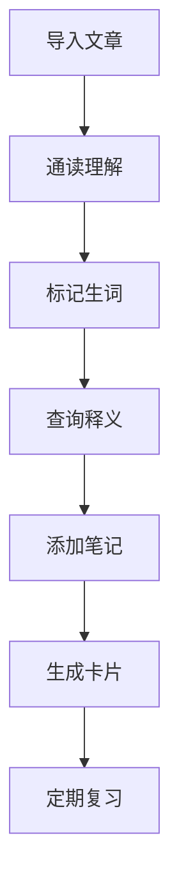
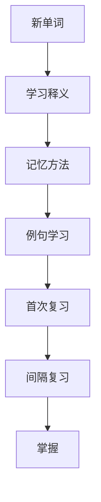

# 📚 仓库使用指南

> 本指南将帮助你快速了解和使用这个英语学习仓库

---

## 📁 目录结构说明

```
sxz_LearnEnglish/
├── 01_ReadingMaterials/          # 阅读材料区
│   ├── Academic/                 # 学术文章
│   ├── Daily/                    # 日常英语
│   ├── News/                     # 新闻资讯
│   ├── Literature/               # 文学作品
│   └── ByLevel/                  # 按难度分级
│       ├── Beginner/             # 初级
│       ├── Intermediate/         # 中级
│       └── Advanced/             # 高级
│
├── 02_Vocabulary/                # 单词库
│   ├── ByAlphabet/               # 按字母索引
│   ├── ByTopic/                  # 按主题分类
│   ├── ByLevel/                  # 按难度分级
│   └── ByMastery/                # 按掌握程度
│
├── 03_Notes/                     # 学习笔记
│   ├── ByDate/                   # 按日期组织
│   └── ByTopic/                  # 按主题分类
│
├── 04_Review/                    # 复习计划
│   ├── DailyReview/              # 每日复习
│   ├── WeeklyReview/             # 每周复习
│   ├── MonthlyReview/            # 每月复习
│   └── SpecialFocus/             # 专项突破
│
├── 05_Resources/                 # 资源库
│   ├── Grammar/                  # 语法资料
│   ├── WritingTemplates/         # 写作模板
│   ├── Listening/                # 听力材料
│   └── Tools/                    # 学习工具
│
├── 06_Templates/                 # 模板文件
│   ├── Reading Template.md       # 阅读模板
│   ├── Vocabulary Template.md    # 单词模板
│   ├── Note Template.md          # 笔记模板
│   └── Review Templates/         # 复习模板
│
├── 07_Dashboards/                # 仪表盘
│   └── Main Dashboard.md         # 主仪表盘
│
└── 08_Statistics/                # 学习统计
```

---

## 🔌 核心插件介绍

### 1. 阅读辅助类

#### Obsidian English Learner
- **功能**: 划词翻译、词典查询、例句展示
- **使用**: 选中英文单词自动显示释义
- **配置**: 在设置中选择词典源和显示样式

#### Various Complements
- **功能**: 自动补全、单词提示
- **使用**: 输入时自动显示相关单词
- **配置**: 设置补全触发条件和显示数量

### 2. 单词管理类

#### Language Learner
- **功能**: 单词卡片创建、间隔重复复习
- **使用**: 一键将生词转为复习卡片
- **配置**: 设置复习间隔和难度系数

#### Spaced Repetition
- **功能**: SM-2 算法复习系统
- **使用**: 根据记忆曲线安排复习
- **配置**: 自定义复习间隔和卡片样式

### 3. 学习记录类

#### Dataview
- **功能**: 数据查询与统计
- **使用**: 自动生成学习报表
- **配置**: 编写查询语句提取数据

#### Calendar
- **功能**: 日历视图、学习打卡
- **使用**: 点击日期查看当天学习内容
- **配置**: 设置日记模板位置

### 4. 效率工具类

#### Templater
- **功能**: 模板自动化
- **使用**: 快速创建标准化笔记
- **配置**: 设置模板文件夹和快捷键

#### Git
- **功能**: 版本控制、自动备份
- **使用**: 自动同步到 GitHub
- **配置**: 设置自动提交间隔

---

## 🎯 核心工作流程

### 流程 1: 阅读学习



**详细步骤**:

1. **导入文章**
   - 复制粘贴文本到 `01_ReadingMaterials` 对应文件夹
   - 使用模板创建阅读笔记
   - 填写元数据（来源、难度、主题等）

2. **阅读标记**
   - 第一遍：快速阅读，理解大意
   - 第二遍：标记生词和难点（使用高亮）
   - 第三遍：深入学习语言表达

3. **生词收集**
   - 选中生词查看释义
   - 点击"添加到单词本"
   - 自动创建单词卡片

4. **笔记整理**
   - 记录重点句型
   - 写下个人理解
   - 关联相关知识

5. **复习巩固**
   - 系统自动安排复习计划
   - 按提示完成每日复习
   - 更新掌握程度

### 流程 2: 单词学习



**详细步骤**:

1. **创建单词卡片**
   - 使用模板或从文章中直接添加
   - 填写完整信息（音标、释义、例句等）
   - 添加记忆方法和相关词汇

2. **学习记忆**
   - 查看词根词缀分析
   - 使用联想记忆法
   - 结合例句理解用法

3. **复习测试**
   - 系统根据 SM-2 算法安排复习
   - 回忆单词释义和用法
   - 评分反馈（简单/正确/困难/忘记）

4. **掌握评估**
   - 根据复习表现调整间隔
   - 达到一定次数标记为掌握
   - 移动到相应掌握程度文件夹

### 流程 3: 笔记整理


---

## 📝 文件命名规范

### 阅读文章
```
格式：YYYYMMDD_文章标题_来源_难度.md
示例：20260412_ClimateChange_NationalGeographic_Advanced.md
```

### 单词卡片
```
格式：单词_词性_主题_难度.md
示例：Photosynthesis_n_Science_IELTS.md
```

### 学习笔记
```
格式：YYYYMMDD_笔记主题.md
示例：20260412_定语从句详解.md
```

### 复习记录
```
格式：YYYYMMDD_DailyReview.md
示例：20260412_DailyReview.md
格式：YYYY-WW_WeeklyReview.md
示例：2026-15_WeeklyReview.md
```

---

## 🎨 标签系统

### 内容类型标签
- `#reading` - 阅读材料
- `#vocabulary` - 单词卡片
- `#note` - 学习笔记
- `#review` - 复习记录

### 难度等级标签
- `#level/beginner` - 初级
- `#level/intermediate` - 中级
- `#level/advanced` - 高级

### 掌握程度标签
- `#mastery/new` - 新学
- `#mastery/learning` - 学习中
- `#mastery/reviewing` - 复习中
- `#mastery/mastered` - 已掌握

### 主题分类标签
- `#topic/academic` - 学术
- `#topic/business` - 商务
- `#topic/daily` - 日常
- `#topic/technology` - 科技

---

## ⚙️ 插件配置要点

### English Learner 配置
```yaml
词典源：Cambridge, Oxford, Merriam-Webster
显示样式：悬浮窗口
快捷键：Ctrl+Shift+D
自动发音：是
```

### Spaced Repetition 配置
```yaml
每日新卡片：20
复习间隔：1, 3, 7, 16, 35...
难度系数：2.5
卡片样式：基础模板
```

### Dataview 配置
```yaml
启用 JavaScript: 是
刷新间隔：5 秒
查询超时：30 秒
```

---

## 🔧 个性化设置建议

### 针对阅读提升
1. 增加阅读量：每日至少 1 篇文章
2. 分级阅读：选择 i+1 难度的材料
3. 精读与泛读结合
4. 建立主题阅读系列

### 针对词汇积累
1. 设定每日目标：10-20 个新单词
2. 重视复习：按时完成系统安排的复习
3. 语境学习：结合文章和例句记忆
4. 建立词汇网络：关联同义词、反义词

### 针对学习习惯
1. 固定学习时间：每日同一时段
2. 番茄工作法：25 分钟专注学习
3. 定期回顾：每周/每月总结
4. 奖励机制：达成目标给自己奖励

---

## 📞 技术支持

### 常见问题
详见 [[常见问题解答]]

### 配置导出
- 插件配置：`.obsidian/` 文件夹
- 数据备份：使用 Git 自动同步
- 配置迁移：复制整个仓库即可

---

*版本：1.0*
*最后更新：2026-04-12*
