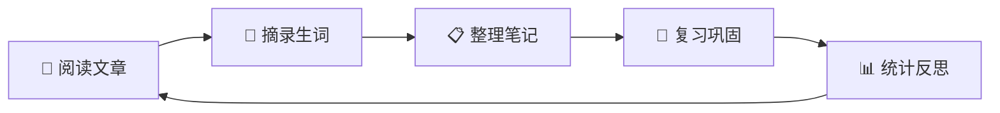

# 📚 英语学习仓库

> [!quote] 每日一句
> The secret of getting ahead is getting started. — Mark Twain

## 快速导航

| 模块 | 说明 | 快速入口 |
|------|------|----------|
| 📖 阅读材料 | 英文文章阅读与标注 | [[阅读材料索引]] |
| 📝 单词库 | 单词管理与记忆 | [[单词库索引]] |
| 📋 学习笔记 | 日常学习记录 | [[学习笔记索引]] |
| 🔄 复习计划 | 间隔重复复习 | [[复习计划索引]] |
| 📊 学习统计 | 进度跟踪与可视化 | [[学习统计面板]] |

## 今日学习

```dataview
TABLE 学习时长, 新增单词, 复习单词, 掌握率
FROM "学习笔记/按日期"
SORT 创建日期 DESC
LIMIT 7
```

## 待复习单词

```dataview
TABLE 掌握程度, 难度等级, 下次复习
FROM "单词库"
WHERE 掌握程度 = "未掌握" OR 掌握程度 = "复习中"
SORT 下次复习 ASC
LIMIT 10
```

## 最近阅读

```dataview
TABLE 阅读状态, 难度等级, 阅读时长
FROM "阅读材料"
SORT 创建日期 DESC
LIMIT 5
```

## 学习工作流



## 快捷操作

- 🆕 新建阅读笔记：`Alt+N` → 选择阅读材料模板
- 📖 划词添加单词：`Alt+W`
- 🔤 快速翻译：`Alt+T`
- 🃏 创建复习卡片：`Alt+F`
- 🔍 全局搜索：`Ctrl+Shift+F`

## 标签体系

| 标签 | 用途 | 示例 |
|------|------|------|
| `#阅读` | 阅读材料标记 | `#阅读/学术`, `#阅读/新闻` |
| `#单词` | 单词笔记标记 | `#单词/日常`, `#单词/学术` |
| `#笔记` | 学习笔记标记 | `#笔记/语法`, `#笔记/心得` |
| `#复习` | 复习相关标记 | `#复习/周计划`, `#复习/月度` |
| `#flashcards` | 间隔重复卡片 | `#flashcards/单词`, `#flashcards/阅读` |
| `#难度` | 难度分级标记 | `#难度/初级`, `#难度/中级`, `#难度/高级` |
